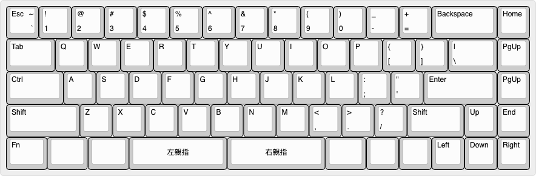
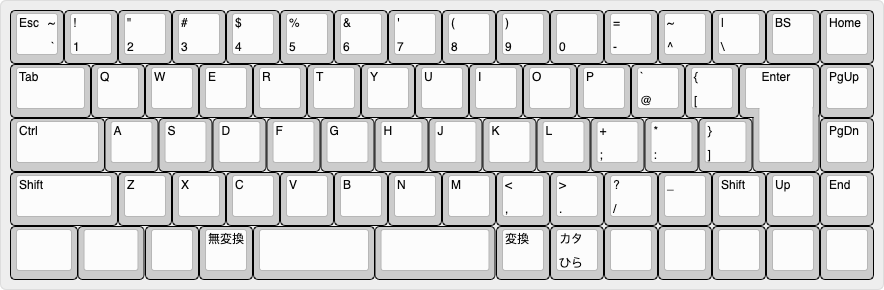
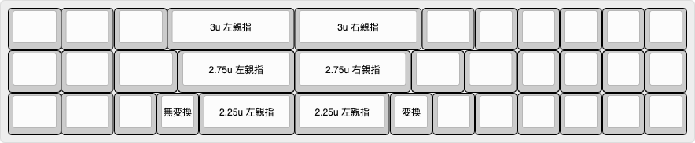

# TS69V3 親指シフト入力に使える一体型 65% キーボード

## 特徴

* US / JP 両対応
* 矢印キーあり
* 対応する親指シフトファームウェアあり [ts69v3 firmware](https://github.com/sadaoikebe/qmk_firmware/tree/master/keyboards/ts69/v3)
* 親指シフト対応、親指キーB下割れ
* 親指キーに3u/2.75u/2.25uのキーキャップの任意の組み合わせが使用できる
* QMK対応

## 物理配列

本PCBで対応する物理配列を以下で解説します。代表的なものは以下の2通りです。

### US配列

<!--
["Esc\n\n~\n`","!\n1","@\n2","#\n3","$\n4","%\n5","^\n6","&\n7","*\n8","(\n9",")\n0","_\n-","+\n=",{w:2},"Backspace","Home"],
[{w:1.5},"Tab","Q","W","E","R","T","Y","U","I","O","P","{\n[","}\n]",{w:1.5},"|\n\\","PgUp"],
[{w:1.75},"Ctrl","A","S","D","F","G","H","J","K","L",":\n;","\"\n'",{w:2.25},"Enter","PgUp"],
[{w:2.25},"Shift","Z","X","C","V","B","N","M","<\n,",">\n.","?\n/",{w:1.75},"Shift","Up","End"],
[{a:7,w:1.25},"",{w:1.25},"",{w:1.25},"",{w:3},"3u 左親指",{w:3},"3u 右親指",{w:1.25},"","","","","",""],
-->

### JP配列
 
<!--
["Esc\n\n~\n`","!\n1","\"\n2","#\n3","$\n4","%\n5","&\n6","'\n7","(\n8",")\n9","\n0","=\n-","~\n^","|\n\\","BS","Home"],
[{w:1.5},"Tab","Q","W","E","R","T","Y","U","I","O","P","`\n@","{\n[",{x:0.25,w:1.25,h:2,w2:1.5,h2:1,x2:-0.25},"Enter","PgUp"],
[{w:1.75},"Ctrl","A","S","D","F","G","H","J","K","L","+\n;","*\n:","}\n]",{x:1.25},"PgDn"],
[{w:2},"Shift","Z","X","C","V","B","N","M","<\n,",">\n.","?\n/","_","Shift","Up","End"],
[{w:1.25},"",{w:1.25},"","","無変換",{w:2.25},"",{w:2.25},"","変換","カタ\nひら","","","","",""],
-->
JP配列のキー数を再現する場合、図のようにShiftの行は左に0.25u移動して、2u左小指シフト/1u右小指シフトを使用します。  
2.25u/1.75uの小指シフトを用いたければ、"_"(アンダースコア)のキーをあきらめてFnキー併用などして入力するようにするとよいでしょう。この場合Shiftの行の物理配列はUS配列と同様になります。  

### 親指シフトキーの選択肢

最下段は使用する親指キーの長さにより割り当てを選択できます。
キーキャップセットによっては、含まれるスペースバーの種類に制約があるけど、できるだけ対応できるようにしました。左右で違う長さの親指キーを使うこともできます。  
2.25uを使用すると、キーが一つ増えます。JP配列の場合は無変換や変換キーを割り当てることを想定しています。US配列の場合はお好みのキーを割り当てられます。

 
<!--
[{a:7,w:1.25},"",{w:1.25},"",{w:1.25},"",{w:3},"3u 左親指",{w:3},"3u 右親指",{w:1.25},"","","","","",""],
[{w:1.25},"",{w:1.25},"",{w:1.5},"",{w:2.75},"2.75u 左親指",{w:2.75},"2.75u 右親指",{w:1.25},"",{w:1.25},"","","","",""],
[{w:1.25},"",{w:1.25},"","","無変換",{w:2.25},"2.25u 左親指",{w:2.25},"2.25u 左親指","変換","","","","","",""]
-->

### 最上段のBackspaceキー

最上段に2u Backspaceを用いるかわりに、2つのキーを割りあてることができます。最上段にBackspaceを割り当てない場合、一般的に上から2段目のキーにBackspaceを割り当てるようです。(HHKB-likeなレイアウトです)

<!--
["Esc\n\n~\n`","!\n1","@\n2","#\n3","$\n4","%\n5","^\n6","&\n7","*\n8","(\n9",")\n0","_\n-","+\n=",{w:2},"Backspace","Home"],
["Esc","!\n1","@\n2","#\n3","$\n4","%\n5","^\n6","&\n7","*\n8","(\n9",")\n0","_\n-","+\n=","|\n\\","~\n`","Home"],
-->

# BOM

Item |ソース | 数量 |  備考
:--- | :--- | :--- | :---
TS69V3 PCBA | [JLCPCB PCBA](pcb/) | 1 |
ケース | [3D Printed](case/) | 1 | 
定位板 | [Laser Cut Brass](plate/) | 1 | t=1.5mm アクリルでも良いが割れやすい
ヒートセット M3x6mmx4.6mm | [AliEx/淘宝等](https://www.aliexpress.com/item/1005002288716120.html) | 10 | 長さは6mmでなくても良い
クッション 2mm厚 x 60mm x 4mm | | 16 | Poron/EVAフォーム等
Pro Micro | [Shigezone等](https://www.shigezone.com/product/arduino-pro-micro/) | 1 | USB-Cタイプがおすすめ
ピンヘッダ 12pin 2.54ピッチ | 電子工作ショップ等 | 2 |
キースイッチ | AliEx/淘宝/自キ専門店等 | 配列によって69〜73個 | 何でもOK(kailh box 白軸がおすすめ)
2u スタビライザー | AliEx/淘宝/自キ専門店等 | 配列によって2〜5個 | 採用したPlateの種類に応じて Plate Mount / PCB Mountを選択
3u スタビライザー | AliEx/淘宝/自キ専門店等 | 配列によって0〜2個 | 
キーキャップ | AliEx/淘宝/自キ専門店等 | 1set | 3u/2.75u/2.25u等の親指キーが計2つ必要

## 組み立て工程

Pro Microを裏側実装する関係で、実装の順番を間違えると*かなり*面倒
1. 基板にスタビライザーを取り付け
2. 基板にピンヘッダを半田付け
3. 定位板に四隅のキースイッチを通す。Pro Microを実装する面の裏のキー(ESCと1)は2つともキースイッチをハンダ付けする。(以後取り外しが極めて難しい)
4. Pro Microを取り付け、キースイッチを取り付け
