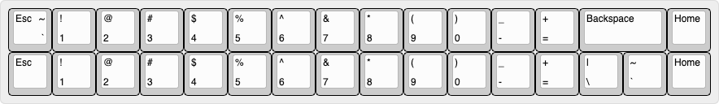

# TS69V3 親指シフト入力に適した 65% キーボード

## 特徴

* QMK対応
* 矢印キーあり
* US / JIS 配列両対応
* 親指キーに使用できるキーキャップの選択肢が多い

## 物理配列

本PCBで対応可能なキーの物理的な配置を以下に示す。

### US配列

最上段は2通りの選択肢がある。2u Backspaceを用いるかわりに、2つのキーを割りあてることができる。

<!--
["Esc\n\n~\n`","!\n1","@\n2","#\n3","$\n4","%\n5","^\n6","&\n7","*\n8","(\n9",")\n0","_\n-","+\n=",{w:2},"Backspace","Home"],
["Esc","!\n1","@\n2","#\n3","$\n4","%\n5","^\n6","&\n7","*\n8","(\n9",")\n0","_\n-","+\n=","|\n\\","~\n`","Home"],
-->

中三段は固定。最上段にBackspaceを割り当てない場合、2段目にBackspaceを割り当てる必要があるが、物理配列は同じ。

<!--
[{w:1.5},"Tab","Q","W","E","R","T","Y","U","I","O","P","{\n[","}\n]",{w:1.5},"|\n\\","PgUp"],
[{w:1.75},"Ctrl","A","S","D","F","G","H","J","K","L",":\n;","\"\n'",{w:2.25},"Enter","PgUp"],
[{w:2.25},"Shift","Z","X","C","V","B","N","M","<\n,",">\n.","?\n/",{w:1.75},"Shift","Up","End"],
-->

最下段は使用する親指キーの長さにより割り当てを選択できる。左右で違う長さの親指キーを使うこともできる。  
キーキャップセットによっては、使用できるスペースバーの種類に制約があるが、できるだけ対応できるようにした。  
2.25uを使用すると、キーが一つ増える。JIS配列の場合は無変換や変換キーを割り当てることを想定するが、US配列の場合はお好みのキーを割り当てるとよい。

 
<!--
[{a:7,w:1.25},"",{w:1.25},"",{w:1.25},"",{w:3},"3u 左親指",{w:3},"3u 右親指",{w:1.25},"","","","","",""],
[{w:1.25},"",{w:1.25},"",{w:1.5},"",{w:2.75},"2.75u 左親指",{w:2.75},"2.75u 右親指",{w:1.25},"",{w:1.25},"","","","",""],
[{w:1.25},"",{w:1.25},"","","無変換",{w:2.25},"2.25u 左親指",{w:2.25},"2.25u 左親指","変換","","","","","",""]
-->

### JIS配列

JIS配列では2u左小指シフト/1u右小指シフトを使用し、JIS配列の全キーを再現することができる。  

 
<!--
["Esc\n\n~\n`","!\n1","\"\n2","#\n3","$\n4","%\n5","&\n6","'\n7","(\n8",")\n9","\n0","=\n-","~\n^","|\n\\","BS","Home"],
[{w:1.5},"Tab","Q","W","E","R","T","Y","U","I","O","P","`\n@","{\n[",{x:0.25,w:1.25,h:2,w2:1.5,h2:1,x2:-0.25},"Enter","PgUp"],
[{w:1.75},"Ctrl","A","S","D","F","G","H","J","K","L","+\n;","*\n:","}\n]",{x:1.25},"PgDn"],
[{w:2},"Shift","Z","X","C","V","B","N","M","<\n,",">\n.","?\n/","_","Shift","Up","End"],
[{w:1.25},"",{w:1.25},"","","無変換",{w:2.25},"",{w:2.25},"","変換","カタ\nひら","","","","",""],
-->

"_"(アンダースコア)のキーをあきらめてFnキー併用とすれば、2.25u/1.75uの小指シフトを用いることもできる。  
US配列の最下段同様、最下段には別のスペースバーを使用することができる。無変換や変換キーを使用したい場合、Fnキーを併用すると良いだろう。

 
<!--
[{a:7,w:1.25},"",{w:1.25},"",{w:1.25},"",{a:5,w:3},"3u 左親指\n無変換",{w:3},"3u 右親指\n変換",{a:7,w:1.25},"","","","","",""],
[{w:1.25},"",{w:1.25},"",{w:1.5},"",{a:5,w:2.75},"2.75u 左親指\n無変換",{w:2.75},"2.75u 右親指\n変換",{a:7,w:1.25},"",{w:1.25},"","","","",""]
-->

# 必要なもの

* TS69V3基板
* ケース
* Pro Micro USB-Cタイプがおすすめ
* ピンヘッダ12ピン×2 コンスルーも使用可
* キースイッチ 配列によって69〜73個
* スタビライザー 配列によって異なる 2x〜5x 2u, 〜2x 3u
* キーキャップ 親指シフト入力では親指キーを多用するため、上面の丸くなっているconvexタイプのキーキャップを使用するとよい。 
* 定位板

## 製造工程

Pro Microを裏側実装する関係で、実装の順番を間違えると面倒。コンスルーを使用すると面倒が省ける
1. 基板にスタビライザーを取り付け
2. 基板にピンヘッダを半田付け(コンスルーを使用する場合半田付け不要)
3. 定位板に四隅のキースイッチを通す。
4. 業者カットの定位板では問題ないけど、定位板を3Dプリンタで制作した場合は、スタビライザーが気持ちよく動くか確認してください。精度が足りないとスタビライザーが動かなくなります。スタビライザーの動きが悪い場合は定位板を作り直すか、少し削ってスタビライザーの動きを良くしてください。
5. キースイッチを全部取り付け
6. Pro Microを取り付け
7. ケースに入れる
8. キーキャップを取り付け
